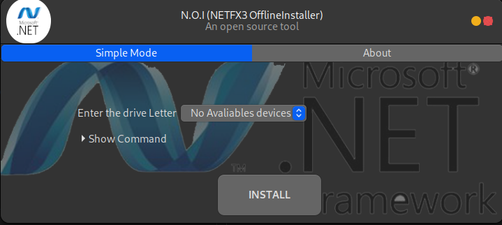

# N.O.I (NetFx3 Offline Installer) vBeta

#### Make by [@Danofred00](https://github/danofred00 "Link to Danofred")
#

This is a little Microsoft Windows .Net Framework 3.0 and 2.0 offline installer. It's open Source tool for windows and easy to use.

## ``How to get it ?``

1. ``Get from binairy file``

    The current version is only for x86_64 OS. Click this link to [download](https://linkhere.com "https://linkhere.com") a file.

    To Download it from command line
    
        

2. ``Get from source code``

    To build it from source code, you must need to have [Gtk 3.24](https://gtk.org) ( x86_64 or x86 ) in your computer.
    This is command to build it from command line

        > git clone https://github.com/danofred00/netfx3_installer.git
        > cd netfx3_installer
        > mingw32_make --makefile=Makefile
        > .\bin\netfx3  (to run it)

## ``How to Use it ?``

Use this tool it very simple. 
1. When the app is opened, mount the image's file of your os
2. Choose the drive's letter of the mounted image system file
3. Then, Click on install to install NetFx3 to your computer

Video is now Unavaliable but later !